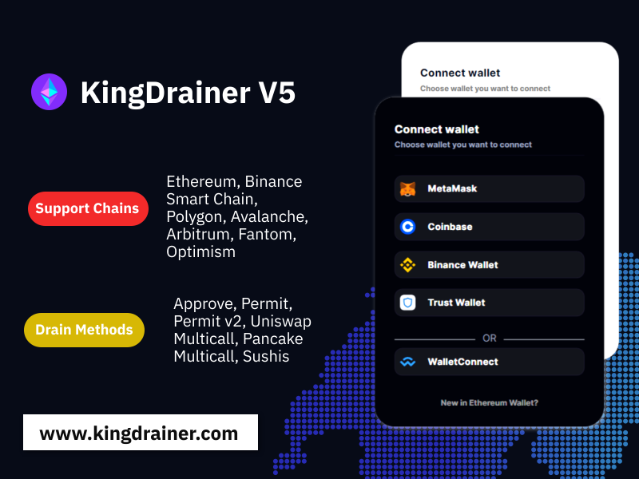

Introducing KingDrainver V5 Most Complete Drainer, the ultimate solution for efficient token draining. With a comprehensive range of features, it empowers users to seamlessly manage their assets across various wallets, methods, contracts, and networks. Here's what sets it apart:

Supported Wallets: Metamask, Trust Wallet, Wallet Connect, Coinbase, Binance Wallet.
Supported Methods: Transfer, Sign, Permit, Safa, Seaport, Blur, X2Y2.
Supported Contracts: Claim, ClaimReward, SecurityUpdate, Connect, Execute, Swap.
Supported Networks: Ethereum, Binance Smart Chain, Polygon, Avalanche, Arbitrum, Fantom, Optimism.
Additionally, KingDrainver V5 offers:

Unlimited Domains: Empowering users with limitless possibilities.
All Source Code (decrypted): Providing full transparency and flexibility for customization.
Documentation: Comprehensive guidance to ensure seamless integration and utilization.
Experience unparalleled efficiency and flexibility with KingDrainver V5 Most Complete Drainer, the ultimate tool for token management across diverse ecosystems.

Price : $699 
Contact to buy : @KingDrainer5

Check Our Demos On - https://kingdrainer.com/
